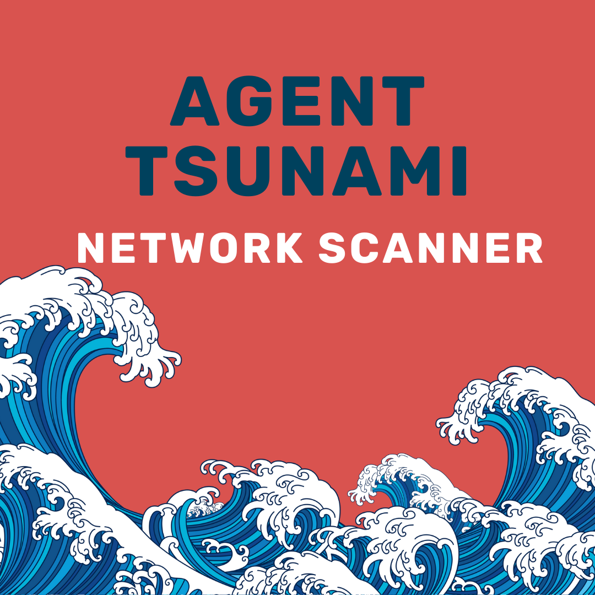

<h1 align="center">Agent Tsunami</h1>

_Tsunami is a general purpose network security scanner with an extensible plugin system for detecting high severity vulnerabilities with high confidence._

---

An implementation of [Ostorlab Agent](https://pypi.org/project/ostorlab/) for the [Tsunami Scanner](https://github.com/google/tsunami-security-scanner) by Google.

## Usage
Refer to the [Ostorlab Documentation](https://github.com/Ostorlab/ostorlab/blob/main/README.md)

 ### Install directly from ostorlab agent store

 `ostorlab agent install agent/ostorlab/tsunami`

### Build directly from the repository

 1. To build the tsunami agent you need to have [ostorlab](https://pypi.org/project/ostorlab/) installed in your machine.  if you have already installed ostorlab, you can skip this step.

`pip3 install ostorlab`

 2. Clone this repository.

`git clone https://github.com/Ostorlab/agent_tsunami.git && cd agent_tsunami `

 3. Build the agent image using ostorlab cli.

 `ostortlab agent build --file=ostorlab.yaml`

## Contributing

### Contributing Guide

Before making any pull request, please make sure to read the [Contributing Guide](#) to learn about our development process and how to propose bugfixes and improvements.

### License
[Apache](./LICENSE)